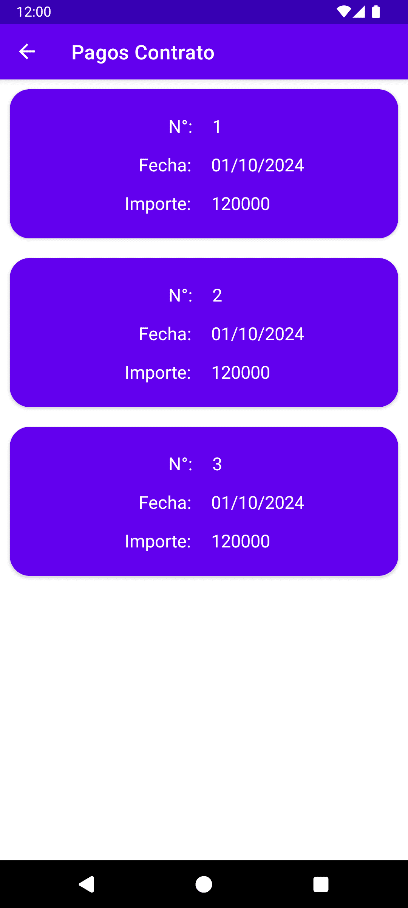

**API:** https://github.com/kevinhuanca/inmobiliaria-api

# Inmobiliaria
Aplicación móvil diseñada para propietarios de una inmobiliaria, permitiéndoles gestionar sus inmuebles y contratos de forma sencilla y segura. La app incluye autenticación, administración de perfil, gestión de inmuebles y control de contratos con sus respectivos pagos.

## Tecnologías utilizadas
- **Aplicación móvil:** Android (Java)
- **Consumo de API:** Retrofit
- **Backend:** ASP.NET Web API
- **Autenticación:** JWT (JSON Web Tokens)
- **ORM:** Entity Framework
- **Base de Datos:** MySQL

## Funcionalidades
- **Autenticación segura:** Login y logout de propietarios.
- **Recuperación de contraseña:** Opción de “Olvidé mi contraseña” con envío de correo.
- **Gestión de perfil:** Ver y editar datos personales, cambiar contraseña.
- **Mapa de ubicación:** Visualización de la inmobiliaria en Google Maps.
- **Contratos y pagos:** Consultar contratos por inmueble y ver detalle de pagos.
- **Gestión de inmuebles:**
  - Listar todos los inmuebles del propietario.
  - Habilitar o deshabilitar un inmueble.
  - Agregar un nuevo inmueble con foto.

## Credenciales de prueba
- Propietario:
  - Usuario: `mp@gmail.com`
  - Contraseña: `123`

## Vista previa

| Inicio de Sesión        | Menú                    | Inicio                  | Perfil                  |
| :---------------------- | :---------------------- | :---------------------- | :---------------------- |
|  |  |  |  |

| Inmuebles               | Agregar Inmueble        | Detalle Inmueble        | Pagos                   |
| :---------------------- | :---------------------- | :---------------------- | :---------------------- |
|  |  |  |  |
